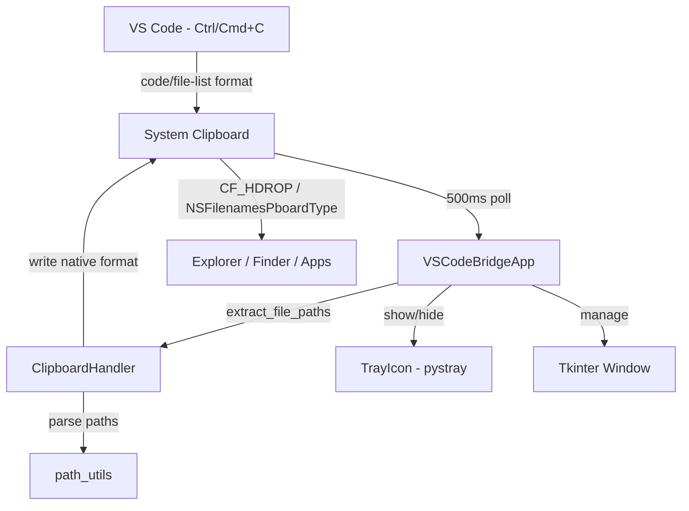
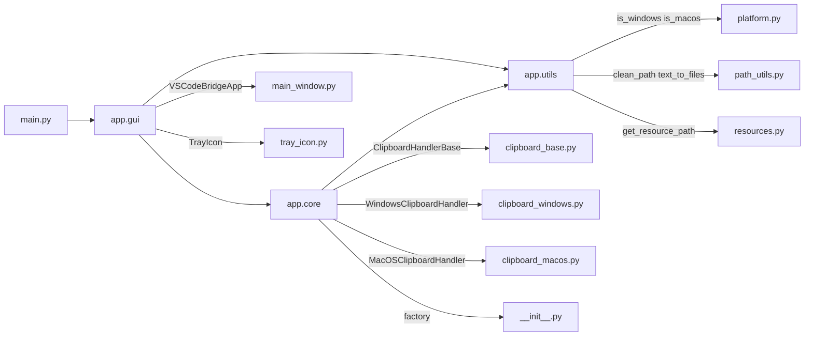
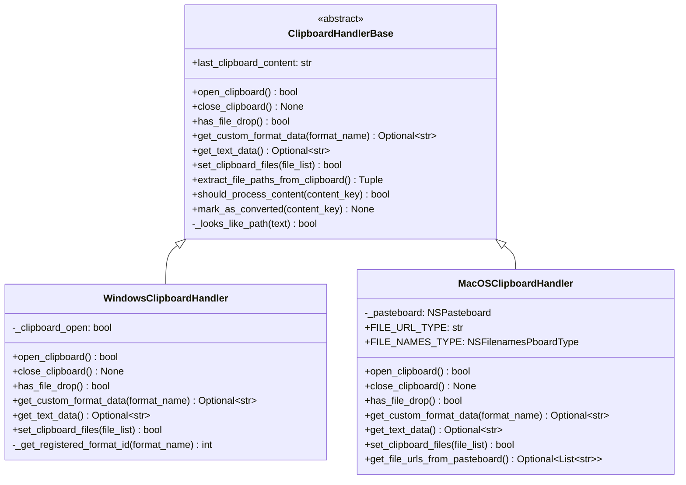
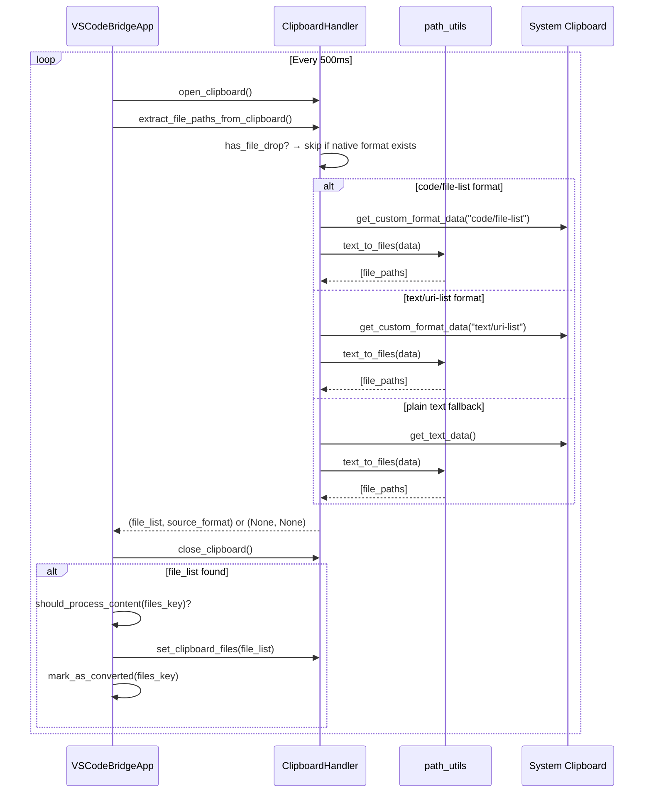
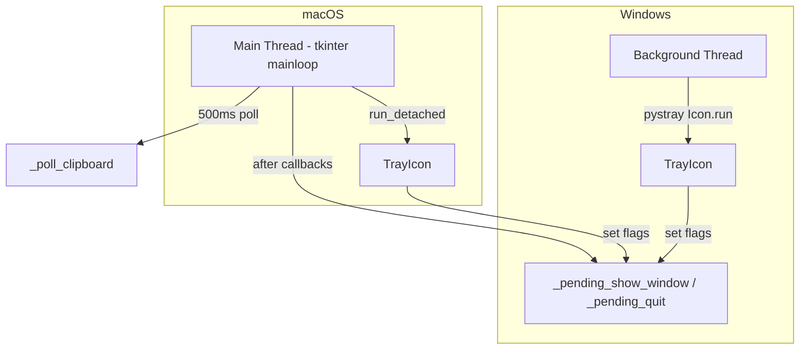

# System Architecture

## High-Level Architecture

## Module Dependency Graph

## Class Hierarchy

## Clipboard Processing Flow

## Platform Implementation Details

### Windows (`clipboard_windows.py`)

- Uses `win32clipboard` module for clipboard operations
- Constructs `DROPFILES` ctypes Structure for `CF_HDROP` format
- `RegisterClipboardFormatW` for custom format detection
- Unicode path support via `fWide = True` in `DROPFILES`
- Multiple encoding fallback: UTF-8 → UTF-16 → Latin-1

### macOS (`clipboard_macos.py`)

- Uses `NSPasteboard` via PyObjC for pasteboard operations
- `NSFilenamesPboardType` and `public.file-url` for native format
- `NSURL.fileURLWithPath_()` for creating file URLs
- `writeObjects_()` for writing file array to pasteboard
- No explicit open/close needed (pasteboard is always accessible)

## Threading Model

- **Windows**: Tray icon runs in a background daemon thread; communicates with tkinter via flags
- **macOS**: Tray icon uses `run_detached()`; flag polling via `root.after(100, _check_tray_flags)`
- No direct tkinter calls from pystray thread (avoids GIL issues)